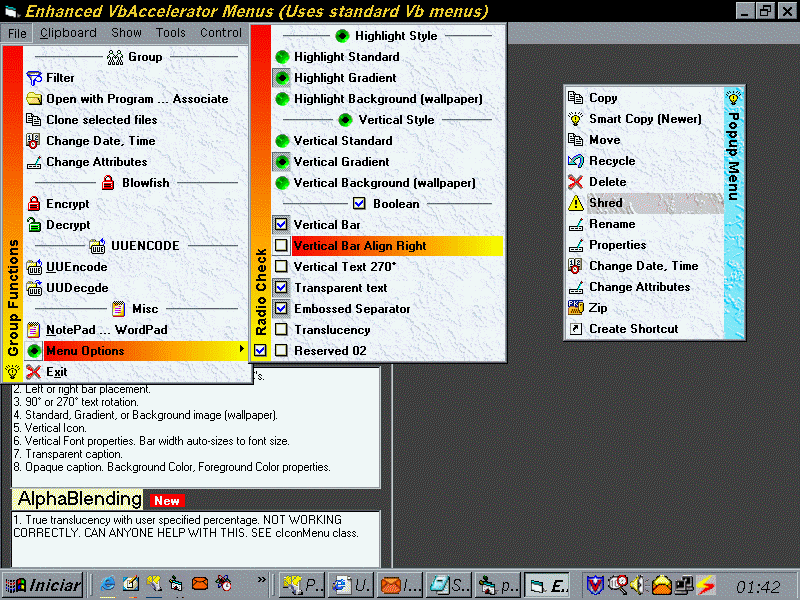



## Update 11\-Aug\-2001\. Enhanced VbAccelerator popup menus\.

### Description

Updated 11-Aug-2001. Enhanced menus builds on Steve's excellent VbAccelerator popup menus which uses standard Vb menus, not complicated menus created at run-time. Enhancements: Transparent or opaque separator captions with icons. Wallpaper highlights. Variable width (autosizes to font) vertical bar created by writing direct to DC's. Left or right orientation. 90° or 270° text rotation. Standard, gradient, or wallpaper style. Individual captions, icons, and font properties. Translucency NOT WORKING CORRECTLY. CAN ANYONE HELP? Rename Alphablend.DL_ to Alphablend.DLL and copy to your windows system directory. See screenshot.
 
### More Info
 

             |
---                |---
**Submitted On**   |2001-08-11 00:29:02
**By**             |[Dana Seaman\_](https://github.com/Planet-Source-Code/PSCIndex/blob/master/ByAuthor/dana-seaman.md)
**Level**          |Advanced
**User Rating**    |4.7 (85 globes from 18 users)
**Compatibility**  |VB 4\.0 \(32\-bit\), VB 5\.0, VB 6\.0
**Category**       |[Custom Controls/ Forms/  Menus](https://github.com/Planet-Source-Code/PSCIndex/blob/master/ByCategory/custom-controls-forms-menus__1-4.md)
**World**          |[Visual Basic](https://github.com/Planet-Source-Code/PSCIndex/blob/master/ByWorld/visual-basic.md)
**Archive File**   |[Update 11\-244268102001\.zip](https://github.com/Planet-Source-Code/dana-seaman-update-11-aug-2001-enhanced-vbaccelerator-popup-menus__1-25708/archive/master.zip)

### API Declarations

Many. See code.

